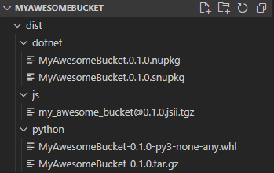

+++
author = "Shawn Vause"
title = "JSii for Polyglot Shops Writing AWS CDK Constructs"
date = "2022-03-14"
summary = """
JSii and related tooling enables polyglot software development shops to write AWS CDK constructs using preferred programming languages. This flexibility keeps developers happy and enables re-use of constructs across departments \
with different development tooling preferences."""
tags = [
    "aws",
    "cdk"
]
+++

As a programmer today, it is likely you will find yourself working in a polyglot, or multiple language environment. We have finally gotten to the place where the merits of different programming technologies can coexist peacefully together. We all know developers are an opinionated breed of individuals. I certainly find a comfort level with specific technology stacks over others. That is completely ok by the way, don't let anyone tell you that your preferred stack is somehow any worse than a different one! You may find strengths/weaknesses across programming languages for different use cases, however having valid evidence to support those claims is way better than simply stating an opinion as fact. Regardless, what is often not okay, is rebuilding functionality in a given language with similar or identical requirements when it doesn't make a measurable difference to do so. After all, we are not providing business value to our customers (at least directly) which is often our primary objective. Someone could argue certainly that it provides developer benefit, maybe it even makes us more efficient as developers, but often with tight deadlines and difficult objectives to hit, we have to make tradeoffs in the work that the team is able to accomplish for a given project, sprint, etc. This brings us to the topic of today's post. My development shop has started adopting the <a href="https://aws.amazon.com/cdk/" title="AWS CDK">AWS CDK</a> as our primary Infrastructure as Code (IaC) solution for greenfield development. I am personally all for this as domain specific languages like HCL for Terraform can feel clunky and cumbersome to utilize with a mindset geared towards for-loops, if conditionals, functions and all the other "goodies" we find in traditional programming languages. In addition, we get strong bundling and dependency management capabilities that help the CDK apps we write feel like any other app we are used to coding!
 

There are efficiencies to gain here, as we can now build custom reusable constructs (think libraries) in the CDK to spin up common infrastructure patterns quickly and easily! We can use a custom construct to do the "heavy-lifting" which allows us to focus on writing business logic and delivering value! We can build packages codifying business requirements for our infrastructure like: common tagging models, use of specific custom domains, security best practices and so much more! Thus, we increase our velocity and deliver more for our customers. However, as previously alluded to, not everyone loves a given programming language. On the web side at our company we currently do a lot of .NET development and our embedded group might gravitate towards something like Python. Again, different strokes for different folks. Differences in opinion are ok, but if we want to achieve economies of scale and get the maximum amount of reuse from these custom constructs, we need a way to meet both groups in the middle. Enter <a href="https://aws.github.io/jsii/" title="JSii">JSii</a>, a fantastic offering from AWS that enables developers to write constructs one time using TypeScript to support all the programming languages CDK targets today. So with one code base we can support C#, Python, Go, Java, JavaScript and of course TypeScript. This embraces our polyglot environment and ensures we are using our time efficiently. Everyone walks away happy able to use their favorite programming language. So how does it work?

JSii sounds complicated on the surface, after all generating code into multiple languages is certainly not an easy problem to solve, but with the great tooling built by the AWS team we can largely be "ignorant" to those implementation details provided you adhere to using TypeScript as the base language and follow a few <a href="https://aws.github.io/jsii/user-guides/lib-author/typescript-restrictions/" title="JSii TypeScript Restrictions">rules</a> for the TypeScript being written. Let's walk through a simple example construct to spin up everyone's favorite demo infrastructure an S3 bucket. Note you should have the CDK installed on your shell to begin, instructions can be found <a href="https://docs.aws.amazon.com/cdk/v2/guide/getting_started.html#getting_started_install" title="CDK Installation">here</a>. Start by creating a new CDK construct project inside a directory named *"MyAwesomeBucket"* using the following command:

```bash
cdk init lib --language=typescript
```

This will create a new CDK construct project with a construct name and an associated properties interface matching the directory name. Inside the *MyAwesomeBucket/lib* directory you will find *index.ts*. This is your starter class inheriting from the standard CDK Construct class. Here we can define our custom construct and any configuration properties it might need. Replace the *MyAwesomeBucket* class definition with the following code and remove the *MyAwesomeBucketProps* interface as it won't be needed for this exercise:

```csharp
export class MyAwesomeBucket extends Construct {

  constructor(scope: Construct, id: string) {
    super(scope, id);

    new s3.Bucket(scope, 'MyAwesomeBucket', {
      encryption: s3.BucketEncryption.S3_MANAGED,
      enforceSSL: true
    });
  }
}
```

Here we have a simple construct that creates an S3 bucket with encryption and a bucket policy that will enforce SSL. These are great best practices that maybe we would want to enforce in our infrastructure across the company. With JSii we can take this code and publish it in a language specific registry for our desired targets. The entire organization can now use it, getting all those best practices for "free". There are only two properties and one resource in this example, but this tiny construct shows the power a larger construct can have in speeding up development and codifying best practices throughout the organization. After all, we can simply new up an instance of this class in our CDK infrastructure stack (after installing the dependency) to create in this case a bucket with encryption and SSL protection already enabled!

So with that established, how do we generate constructs using the JSii tooling for all these language targets? First we should install JSii dependencies into our *package.json*. Run the following command in your solution:

```bash
npm install jsii jsii-pacmak -D
```

This command installs the two tools we need for this simple walkthrough. JSii will provide the TypeScript compiler for our construct and jsii-pacmak will provide the tooling to generate language-specific packages from our construct code. Speaking of which, JSii will generate your *tsconfig.json* file for you, so go ahead and delete that file. The next step requires us to make some updates to our *package.json*. First replace the *script* block with the following JSii specific commands:

```json
"scripts": {
    "build": "jsii -vvv",
    "watch": "jsii -w",
    "package": "jsii-pacmak -vvv"
}
```

In addition, we must add an *author* object property with *name* and *email* specified, the *repository* object property with the *url* set to the git repository location, a valid *license* property, a *description* and a *homepage* are also recommended suggestions. While these items seem trivial, the JSii tooling is very particular about how the *package.json* file looks. Finally, we must add a *jsii* object property similar to the following:

```json
  "jsii": {
    "outdir": "dist",
    "targets": {
      "python": {
        "distName": "MyAwesomeBucket",
        "module": "MyAwesomeBucket"
      },
      "dotnet": {
        "namespace": "MyAwesomeBucketNS",
        "packageId": "MyAwesomeBucket"
      }
    }
  }
```

This property tells the JSii tooling where to place the compiled (ready-to-publish) packages and what language targets you want to support. To keep things concise, we will use just Python and .NET. Simply specify your naming configuration for each target and JSii will handle the rest! Now we should be able to run the following command and verify there are no errors (note the *watch* command is handy to use during development as it watches for changes and runs the build on save, enhancing the feedback loop while working on the code):

```bash
npm run build
```

Assuming there were no errors we are finally ready to build the packages. As you can probably guess running the *package* command will do the deed. However, you may find yourself on a development machine without specific versions of tooling for your configured targets. No worries, JSii has you covered with this Docker image <a href="https://hub.docker.com/r/jsii/superchain" title="jsii/superchain">jsii/superchain</a>! Choose the image version tag that fits your needs and mount a volume or clone your repository inside the docker image. A command like this one should help get you there if you choose to mount a volume:

```bash
docker run -it --rm --entrypoint sh -v /dev/temp/MyAwesomeBucket:/MyAwesomeBucket jsii/superchain:latest
```

Inside the container, change your directory into the *MyAwesomeBucket* folder, run your dependency installation if necessary and finally run the following:

```bash
npm run build && npm run package
```

Assuming everything is successful your JSii outdir (*dist* if you followed the snippet above) will now have a folder for each target with artifacts ready for publishing to npm, PyPi and Nuget with standard publishing tools!
<br/><br/>


So I know what you are likely thinking, this is great but what is the catch? There are always tradeoffs in these situations where we sacrifice something for the flexibility and benefits a tool like JSii offers. Well honestly the only thing I have found to date are performance implications. As this <a href="https://aws.amazon.com/blogs/opensource/generate-python-java-dotnet-software-libraries-from-typescript-source/" title="JSii AWS Blog Post">post</a> details, the "magic" behind JSii is that native language calls proxy JavaScript code to an embedded JavaScript VM, enabling the write once, run everywhere benefits we love. Obviously, this has implications and might rule it out for some performance sensitive use cases. If you read further in the post there are some benchmark comparisons for you to examine. I would argue for my company's needs, we are simply running this infrastructure code in CICD to spin up/update AWS architecture. If it takes a little longer to do so, that is not a deal breaker. After all, it is not like this infrastructure code is hosting web traffic that needs to happen quickly and at scale!

In closing, JSii brings a ton of value to the table and can satisfy everyone by meeting them at the level of the tools and languages they use daily. Languages are likely to be added over time and with AWS backing/supporting the JSii ecosystem, you can relax in knowing it will be maintained for years to come. I personally am hoping to see an inner-sourcing initiative take off at my company with everyone contributing, consuming and using these packages to ultimately move faster and drive business value.
