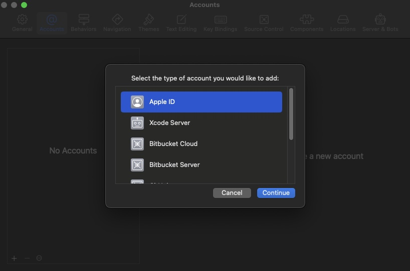
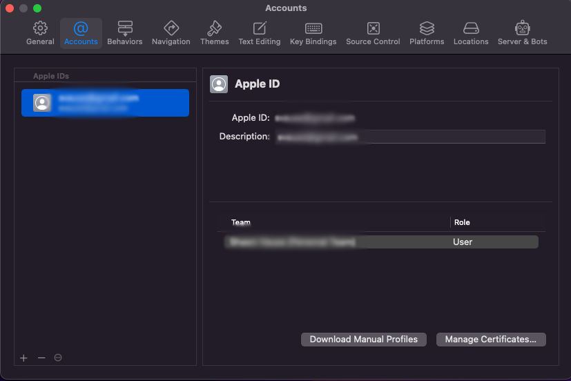
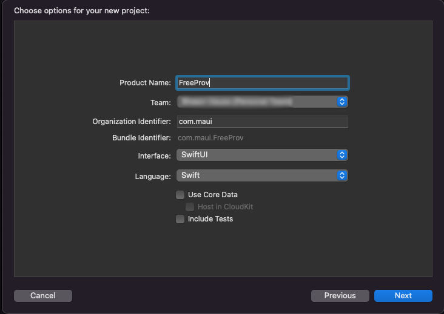
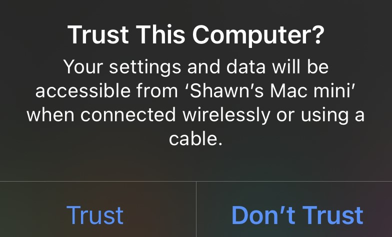
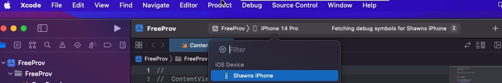
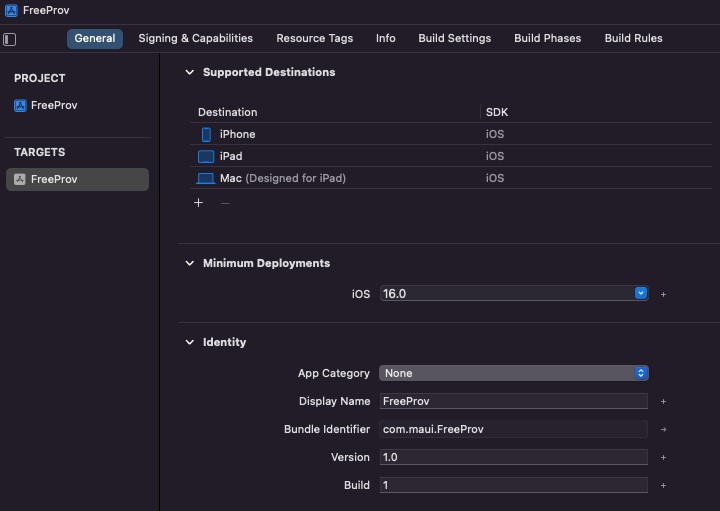
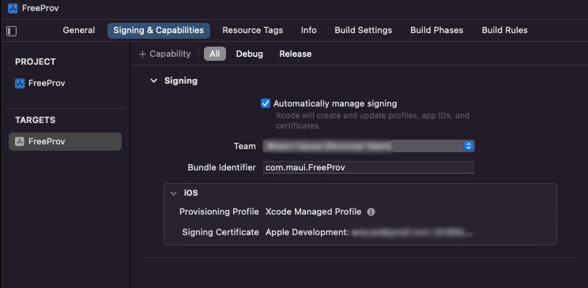

+++
author = "Shawn Vause"
title = ".NET MAUI iOS Free Provisioning"
date = "2022-09-11"
tags = [
    "dotnet",
    "maui",
    "ios",
    "mobile"
]
summary = """
Contrary to popular belief, it is possible to run an iOS application on your iPhone/iPad without paying the $99 USD fee per year to Apple for a developer program account. Through a process called free provisioning we can gain this freedom. It is a relatively simple task to accomplish and only involves some clicking around Xcode. There is no jailbreaking involved and it is supported by Apple. It does have some limitations that we will get into, but for those learning mobile development in Apple's walled garden of a platform, it is a great way to get started without the added expense."""
draft = true
+++

Contrary to popular belief, it is possible to run an iOS application on your iPhone/iPad without paying the $99 USD fee per year to Apple for a developer program account. Through a process called free provisioning we can gain this freedom. It is a relatively simple task to accomplish and only involves some clicking around Xcode. There is no jailbreaking involved and it is supported by Apple. It does have some limitations that we will get into, but for those learning mobile development in Apple's walled garden of a platform, it is a great way to get started without the added expense.

We will demonstrate how free provisioning gets us started running code on our iOS device, through the lens of the relatively new <a href="https://docs.microsoft.com/en-us/dotnet/maui/what-is-maui" title=".NET MAUI">.NET MAUI platform</a>. For those unaware, .NET MAUI is a solution that allows us to write a single UI using XAML or Blazor based controls that will run across iOS, Android, Mac and Windows. There are also capabilities to call into platform specific code as needs dictate, for instance to access sensors or platform specific APIs like those provided for in-app purchases. A simulator does exist for iOS on the Mac and Visual Studio provides some great tooling around remoting to your simulator from Windows environments. However, there is no substitute for running your software on physical hardware while developing. Frankly, it is a faster experience and a lot closer to how your customers will use your application.


### Requirements

- Visual Studio 2022 17.3.0 or above with the .NET MAUI workload installed
- A Mac to compile and plug your iPhone/iPad device into
- Xcode latest version installed on your Mac
- An Apple ID not connected to Apple Developer Program

### Xcode Steps

Begin by opening Xcode on your Mac and navigating via the menu bar to *Xcode > Preferences*. Under the *Accounts* tab, click the plus button to add your Apple ID account to Xcode using your user name and password.
  
 

Close the dialog and proceed to create a new *App* project. Make sure to note your exact bundle identifier (in my case *com.maui.FreeProv*) and choose the team "*Your Name (Personal Team)*" created when you added your Apple ID to Xcode. 

 
Once Xcode is done doing its thing, plug your iOS device into the Mac and unlock your phone so you can confirm you trust the mac to access your device, example below: 

You will also need to enable *Developer Mode* on your phone by visiting *Settings > Privacy and Security > Developer Mode* and enabling the setting with the toggle. Note, your device will need to restart at this point and you must confirm that you want to turn developer mode on after the phone is unlocked.

Back in Xcode, at the top of your App project's window, you will find a bread crumb control beside the project name. It is mostly likely pointing at an *iPhone (model)* value. Click that and choose your device in the dropdown under the iOS Device heading. 

Next we have to configure the project settings to get our bundle identity signed. To do this click on the left side of the Xcode window in the project navigator on the top level node, in my case the *FreeProv* project. This will open the project properties tab. Verify the bundle identifier from earlier (remember I had you note this value) it must be exactly the same as the value you saw when creating the project. This is an important time to call out the profile we create is only for this identifier. When we setup some configuration in Visual Studio it will have to match this value exactly yet again. Set a *Display Name* while we are working in this section as well. Another value to note is the *Minimum Deployments* setting. This value must match or be lower than the iOS version running on the device you are using. 

Finally, switch tabs in the project settings dialog to *Signing & Capabilities* and choose to *Automatically manage signing* with the *Your Name (Personal Team)* value selected. 

If you click on the information icon next to the words *Xcode Managed Profile* you will see what was generated. You will also see the biggest limitation of this free provisioning process. The provisioning profile is only good for six days! Thankfully, you can just renew this value using an abbreviated version of the process discussed thus far. Please note though, signing identities will expire after a year. 

At this point you can optionally deploy the sample application from Xcode to your device if you want to verify it is working as expected. Simply click the run button. It probably failed at this point saying it was an untrusted developer who built the app. Once again visit *Settings* and go to *General > VPN & Device Management*. There will be a developer app setting with your email there it says "Not Trusted" underneath. Click it and press the *Trust "Apple Development: (your email)* button. Finally, confirm in the dialog that you trust yourself (unless you really don't :smirk:). Run the app again and things should go more smoothly this time. 

### Visual Studio Steps

Leave your iOS device connected to the Mac. Connect to your Mac from Visual Studio. Instructions can be found [here](https://learn.microsoft.com/en-us/dotnet/maui/ios/pair-to-mac) if needed. On your new MAUI project (I did the .NET MAUI Blazor App for fun) navigate to your project properties in the solution explorer. Scroll down to the iOS settings block on the left hand side and click *Bundle Signing*. Here you need to ...TODO
