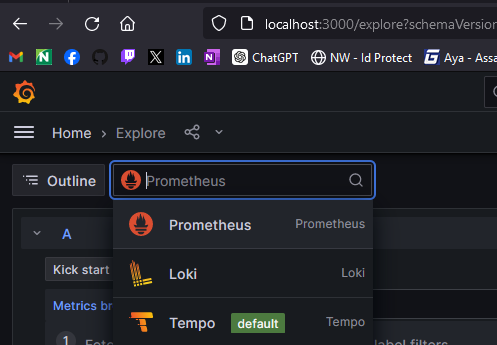
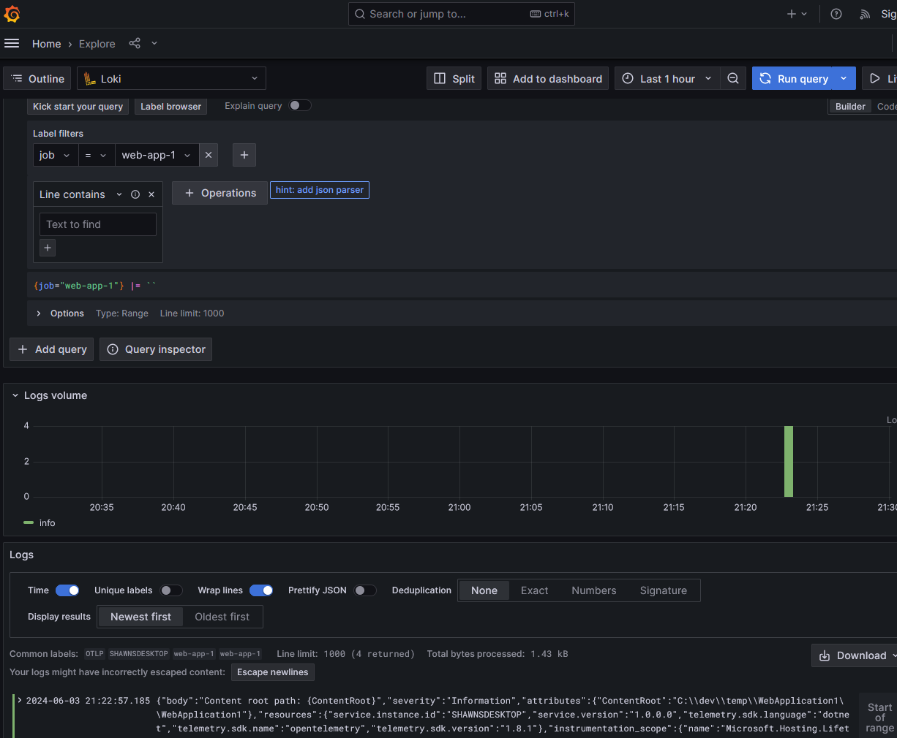
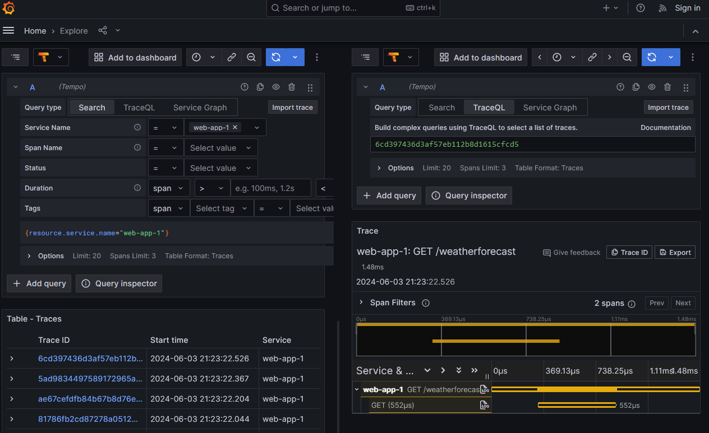
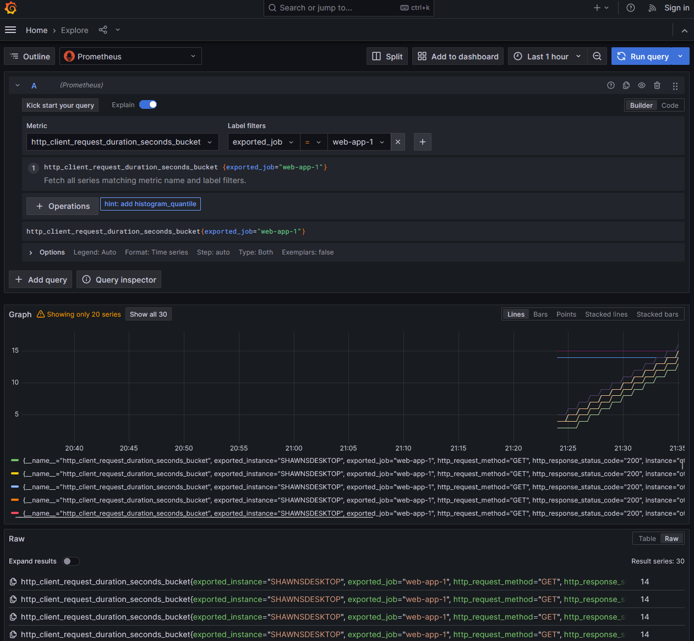

+++
author = "Shawn Vause"
title = "OpenTelemetry for .NET Solutions with Grafana Tooling - Services Setup"
date = "2024-06-03"
summary = """
An overview on setting up OpenTelemetry and OpenTelemetry Collector for .NET Core solutions, along with the necessary configuration to setup a cohesive observability solution utilizing \
OSS offerings Grafana, Grafana Tempo, Grafana Loki and Prometheus."""
tags = [
    "dotnet",
    "opentelemetry",
    "observability"
]
+++

Welcome to part two of the series I started [here](/posts/opentelemetry-dotnet)! We will pick up with going over the necessary services to support the OpenTelemetry data being pumped in from our sample web application. We will utilize Docker compose as it provides a simple and easy way to orchestrate the necessary containers to send our observability data to. [OpenTelemetry Collector](https://github.com/open-telemetry/opentelemetry-collector) will be used as a central hub for receiving the observablity data from our application. We can then distribute data across a variety of services including [Grafana Loki](https://grafana.com/oss/loki/) for logs, [Grafana Tempo](https://grafana.com/oss/tempo/) for traces and the [Prometheus](https://prometheus.io/) time series database for metrics. Finally, viewing the observability data in meaningful ways will require use of the popular [Grafana](https://grafana.com/oss/grafana/) visualization platform which provides us with data exploration tools for the aforementioned data types as well as graphical tooling to create graphs and dashboards from. Ultimately, the tools at our disposal enable us to build the elusive "single pane of glass" view for our application and how it is performing. Let's jump in!


### OpenTelemetry Collector

The OpenTelemetry Collector is a service used to glue disparate observability solutions together. Think of it as the "hub" in a wheel and spoke architecture. Our web application will use the [OpenTelemetry Protocol (OTLP)](https://opentelemetry.io/docs/specs/otel/protocol/) supported by the OTEL collector to send all observability data (logs, traces, metrics) in a consistent way. This means our application only needs to take on the exporter dependency mentioned in the first part of this series for OTLP. All the data is thus sent to the collector "speaking the same language" vs having different protocols and specifications that would need maintained and supported. An added benefit of this approach is that if each application "speaks OTLP" we can spin up an auto scaling/load balanced environment that all our web applications and services (potentially written with a microservices architectural style) send observability data to, allowing for reuse of code, configuration and potentially infrastructure across our environment.

Configuring the OTEL collector allows us to use solutions potentially outside the OpenTelemetry ecosystem. For instance, metrics can be stored in a variety of data stores such as time series databases like Prometheus, traces can be stored in Grafana Tempo and logs in Grafana Loki. Rather than have our application directly talk to these tools, the OTEL collector intermediary gives us the opportunity to transform the data or perform some other pre-load activities. Typically this is setup using some YAML based configuration that the OTEL collector understands and utilizes to transform and forward observability data to the down stream solution (such as Prometheus).

#### OpenTelemetry Collector Configuration

I recommend you start by creating a folder in your solution for these configuration files called `observability` or something similar. Inside that folder create a file called `otelcol-config.yaml` Let's walk though the core sections of the yaml file typically present. For a more comprehensive look, examine the official documents found [here](https://opentelemetry.io/docs/collector/configuration/https://opentelemetry.io/docs/collector/configuration/). The YAML below is broken up into four key sections: receivers, processors, exporters and services.

Receivers are observability data providers. Our applications wire up to the OTLP protocol endpoint(s) documented below and send all their OTEL data for ingestion.

Processors are an optional but recommended configuration element for the OTEL collector. These items give us a chance to modify or transform observability data before they are exported/delivered to downstream tools and databases. The *batch* processor noted in the configuration sample is responsible for compressing and grouping observability data. This makes more efficient use of the networking connections in our solution architecture.

Exporters simply send data to the desired destination(s) after processing has been performed. Note, we are setting the default logging level for all exporters to "Debug" in this section. This ensures you will get some data in this demo, but it may not be the desired level in production or when you are paying for log volume in a cloud/vendor solution.

Services are essentially an index of the receivers, processors and exporters configured within the other sections. Ultimately, the configuration here determines what services are enabled in the OTEL collector. The sub-section `pipelines` allows us to wire up configuration for logs, metrics and trace data in different ways. You will notice the configuration utilizes OTLP for all the observability data points as the receiver. The batch processors also ensure efficient use of network resources for metrics and logs.

Let's now walk through each tool we will utilize for each type of observability data.

```yaml
receivers:
  otlp:
    protocols:
     http:
       endpoint: 0.0.0.0:4318
     grpc:
       endpoint: 0.0.0.0:4317

processors:
  batch:

exporters:
  logging:
    loglevel: debug

service:
  pipelines:
    traces:
      receivers: [otlp]
      exporters: []
    metrics:
      receivers: [otlp]
      processors: [batch]
      exporters: []
    logs:
      receivers: [otlp]
      processors: [batch]
      exporters: []
```

#### Grafana Loki

Let's talk about logs. Logs are preferably structured data points providing valuable insight from a given application. They should be used in conjunction with traces and metrics to provide a complete picture of how your application is performing and what it is doing at a given point in time. [Grafana Loki](https://grafana.com/oss/loki/) is an open source solution that provides storage, aggregation and query capabilities for you guessed it, log data.

Basic configuration of Loki is pretty easy to accomplish. First let's setup a resource processor for Loki by adding the following yaml to our original snippet.

```yaml
processors:
  batch:
  resource:
    attributes:
      - action: insert
        key: loki.resource.labels
        value: service.name
```

A resource processor is used to add, update or delete resource attributes on telemetry data. These key-value pairs provide contextual information about the source of the telemetry. In this case, we are adding a new attribute (inserting) with the key `loki.resource.labels`. Here we set the value to the service name producing the logs.

Next let's define an exporter in our yaml file.

```yaml
exporters:
  logging:
    loglevel: debug

  loki:
    endpoint: "http://loki:3100/loki/api/v1/push"
    tls:
      insecure: true
    default_labels_enabled:
      exporter: true
      job: true
```

The above yaml wires up an OTEL exporter for Loki by providing the endpoint to send log data to. Note, this is not a production safe configuration as we are not using *https* to keep things simple. In addition, some default log labels are applied for job and exporter information. Be aware that if all default labels are omitted and there are no other labels on the log it will be dropped.

Finally, we wire up the pipeline to send log data to the appropriate processors and receivers. Make the following yaml updates below.

```yaml
    logs:
      receivers: [otlp]
      processors: [batch, resource]
      exporters: [loki]
```

Notice how we are processing log data with our resource processor and exporting to our Loki exporter. It should now make sense why there are called "pipelines" as we are essentially stitching together receivers, processors and exporters to provide a given type of observability data in our desired format to downstream services.

#### Grafana Tempo

Now that you understand the workflow involved with configuring a service, let's setup [Grafana Tempo](https://grafana.com/oss/tempo/) for trace data. Tempo is another open source Grafana Labs solution for analyzing and storing distributed trace data. The following yaml updates in `otelcol-config.yaml` are required:

```yaml
exporters:
  # Other sections omitted for brevity

  # Add the following
  otlp:
    endpoint: tempo:4317
    tls:
      insecure: true

service:
  pipelines:
    # Other sections

    # Add the following
    traces:
      receivers: [otlp]
      exporters: [otlp]
```

We do not have a processor to run on our data so this configuration is a lot more simplistic. Essentially, we are declaring an exporter for Tempo with the desired endpoint and again disabling *https*. We then forward our data from the OTEL collector OTLP endpoint directly to Tempo's. Easy peasy lemon squeezy.

Tempo requires some additional configuration. In your observability folder add a `tempo.yaml` file and paste in the following details:

```yaml
stream_over_http_enabled: true
server:
  http_listen_port: 3200
  log_level: info

query_frontend:
  search:
    duration_slo: 5s
    throughput_bytes_slo: 1.073741824e+09
  trace_by_id:
    duration_slo: 5s

distributor:
  receivers:                           # this configuration will listen on all ports and protocols that tempo is capable of.
    jaeger:                            # the receives all come from the OpenTelemetry collector.  more configuration information can
      protocols:                       # be found there: https://github.com/open-telemetry/opentelemetry-collector/tree/main/receiver
        thrift_http:                   #
        grpc:                          # for a production deployment you should only enable the receivers you need!
        thrift_binary:
        thrift_compact:
    zipkin:
    otlp:
      protocols:
        http:
        grpc:
    opencensus:

metrics_generator:
  registry:
    external_labels:
      source: tempo
      cluster: docker-compose
  storage:
    path: /tmp/tempo/generator/wal
    remote_write:
      - url: http://prometheus:9090/api/v1/write
        send_exemplars: true

storage:
  trace:
    backend: local                     # backend configuration to use
    wal:
      path: /tmp/tempo/wal             # where to store the the wal locally
    local:
      path: /tmp/tempo/blocks

overrides:
  defaults:
    metrics_generator:
      processors: [service-graphs, span-metrics] # enables metrics generator
```

For an in-depth discussion what these settings accomplish, see the official documentation [here](https://grafana.com/docs/tempo/latest/configuration/#configure-tempo). Note, we are using metrics generator to send metrics generated from trace data to Prometheus which we will configure next.

#### Prometheus

[Prometheus](https://prometheus.io/) is an open-source systems monitoring and alerting toolkit that provides a multi-dimensional time series database organized by metric name and key/value pairs. We will send our metric data there by adding the configuration below:

```yaml
exporters:
  # Other sections omitted for brevity

  # Add the following
  prometheus:
    endpoint: "0.0.0.0:8889"

service:
  pipelines:
    # Other sections

    # Add the following
    metrics:
      receivers: [otlp]
      processors: [batch]
      exporters: [prometheus]
```

Again, we simply declare the endpoint for the Prometheus exporter and push the data to it using the batch processor.

Prometheus requires a little more configuration of its own as well. Create the following file in your `observability` folder and name it `prometheus.yaml`.

```yaml
global:
  scrape_interval:     15s
  evaluation_interval: 15s

scrape_configs:
  - job_name: 'prometheus'
    static_configs:
      - targets: [ 'localhost:9090' ]
  - job_name: 'tempo'
    static_configs:
      - targets: [ 'tempo:3200' ]
  - job_name: 'otelcol'
    scrape_interval: 1s
    static_configs:
      - targets: [ 'otelcol:8889' ]
```

Essentially, we are collecting metrics from the OTEL collector, Tempo and even Prometheus itself with this configuration. See the [official documentation](https://prometheus.io/docs/prometheus/latest/configuration/configuration/) for further details.

### Running the services

First we must create one more configuration file to create an index of datasources for the Grafana visualization platform to be aware of. Create `grafana-datasources.yaml` in your `observability` folder as follows:

```yaml
apiVersion: 1

datasources:
- name: Loki
  type: loki
  access: proxy
  url: http://loki:3100

- name: Tempo
  type: tempo
  access: proxy
  orgId: 1
  url: http://tempo:3200
  basicAuth: false
  isDefault: true
  version: 1
  editable: true
  apiVersion: 1
  uid: tempo
  jsonData:
    httpMethod: GET
    serviceMap:
      datasourceUid: prometheus
    tracesToLogsV2:
      datasourceUid: Loki
      tags: []
      filterByTraceID: false
      filterBySpanID: false
      customQuery: false
    tracesToMetrics:
      datasourceUid: prometheus
      tags: []
      filterByTraceID: false
      filterBySpanID: false
      customQuery: false

- name: Prometheus
  type: prometheus
  uid: prometheus
  access: proxy
  orgId: 1
  url: http://prometheus:9090
  basicAuth: false
  isDefault: false
  version: 1
  editable: false
  jsonData:
    httpMethod: GET
```

This file literally wires up datasources we configured previously and dependencies between them (such as stitching traces to metrics and logs). This index will allow Grafana to visualize and query the data.

Utilizing Docker desktop run `docker compose up` on your terminal in a directory with the following `docker-compose.yaml` file a level up from your `observability` folder. Note, the volumes configured for data persistance across restarts of the services and linking to the configuration files we created.

```yaml
services:
  grafana:
    image: grafana/grafana:10.3.1
    environment:
      - "GF_AUTH_DISABLE_LOGIN_FORM=true"
      - "GF_AUTH_ANONYMOUS_ENABLED=true"
      - "GF_AUTH_ANONYMOUS_ORG_ROLE=Admin"
      - "GF_FEATURE_TOGGLES_ENABLE=traceToMetrics"
    volumes:
      - ./observability/grafana-datasources.yaml:/etc/grafana/provisioning/datasources/datasources.yaml
    ports:
      - "3000:3000"
    depends_on:
      - tempo
      - loki

  otelcol:
    image: otel/opentelemetry-collector-contrib:0.95.0
    deploy:
      resources:
        limits:
          memory: 125M
    restart: unless-stopped
    command: [ "--config=/etc/otelcol-config.yaml" ]
    volumes:
      - ./observability/otelcol-config.yaml:/etc/otelcol-config.yaml
    ports:
     - "4317:4317"        # OTLP gRPC receiver
     - "4318:4318"        # OTLP HTTP receiver

  loki:
    image: grafana/loki:2.9.4
    ports:
      - "3100"
    command: -config.file=/etc/loki/local-config.yaml
    volumes:
      - ./observability/loki-data:/loki
    depends_on:
      - otelcol

  tempo:
    image: grafana/tempo:2.3.1
    command: [ "-config.file=/etc/tempo.yaml" ]
    volumes:
      - ./observability/tempo.yaml:/etc/tempo.yaml
      - ./observability/tempo-data:/tmp/tempo
    ports:
      - "14268"  # jaeger ingest
      - "3200"   # tempo
      - "4317"   # otlp grpc
      - "4318"   # otlp http
      - "9411"   # zipkin
    depends_on:
      - prometheus
      - loki

  prometheus:
    image: prom/prometheus:v2.50.0
    command:
      - --config.file=/etc/prometheus.yaml
      - --web.enable-remote-write-receiver
      - --enable-feature=exemplar-storage
      - --enable-feature=promql-experimental-functions
    volumes:
      - ./observability/prometheus.yaml:/etc/prometheus.yaml
      - ./observability/prometheus-data:/prometheus
    ports:
      - "9090:9090"
```

Congratulations! It has been a bit of a journey to get to this point. If all spins up as it should, then visit in your browser http://localhost:3000. If you click on the hamburger menu and *Explore* you should see the following datasources in the drop down:



Set your `appsettings.json` in your web application from the first post as follows for these properties to enable OTLP as our exporter:

```json
{
  ...
  "UseTracingExporter": "otlp",
  "UseMetricsExporter": "otlp",
  "UseLogExporter": "otlp",
  ...
}
```

Run your web application and make some API requests to generate some data. If you query Loki in the Grafana UI you should see log data like the following (note the job filter is set to \"web-app-1\"):



Tempo will have trace data along with a fancy flame graph when you select a trace ID:



Finally, Prometheus will have a host of metric values for your perusal:



Feel free to experiment and build/install visualizations to your heart's content!
