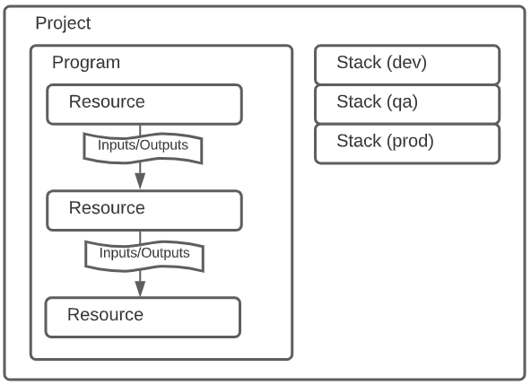
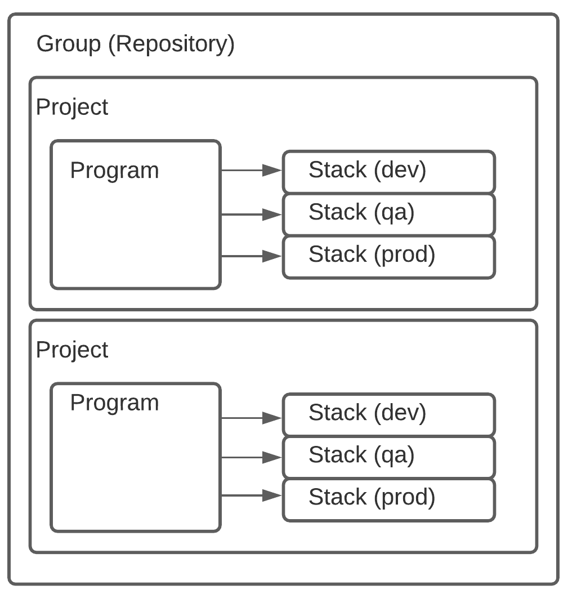

+++
author = "Shawn Vause"
title = "Think Outside the Stack With Pulumi"
date = "2021-09-27"
tags = [
    "infrastructure-as-code",
    "digital-ocean",
    "cloud"
]
+++

<a href="https://www.pulumi.com/" title="Pulumi" target="_blank">Pulumi</a> is a powerful infrastructure as code (IaC) tool with a fantastic superpower you just don't get with products like <a href="https://www.terraform.io/" title="Terraform" target="_blank">HashiCorp's Terraform</a>. You can harness the power of your favorite programming <a href="https://www.pulumi.com/docs/intro/languages/" title="Pulumi Languages" target="_blank">languages</a> and apply them for another purpose. Rather than learning a domain specific language (DSL) that is largely a "one-trick pony" you can make your favorite programming language build cloud infrastructure! How cool is that? HashiCorp Configuration Language (<a href="https://www.terraform.io/docs/language/syntax/configuration.html" title="HCL Syntax" target="_blank">HCL</a>), while powerful, is frankly used for one thing and one thing only, infrastructure. It can do the job well, there is no argument we have gotten our mileage out of this tool and tools like it (I am looking at you AWS Cloudformation). However, it immediately starts to break down as you get more sophisticated. Looping, conditionals, etc. while supported have largely been bolted on as customers started to hit the edges of this tool chain. Which begged the important and maybe obvious question, "Why are we forcing ourselves to use a language not designed for this level of sophistication, when we have world class languages that would certainly be up to the task?" As a result, I would argue another wave of IaC tools was kicked off with players like AWS launching their Cloud Development Kit (CDK), Pulumi launching a cross-cloud/cross-service SDK and even HashiCorp recognized the need to grow past HCL. I will leave the reader to investigate the merits of each toolchain, as this was not the intent of this post. Today I want to introduce the Pulumi stack concept and the flexibility it can provide in building our cloud infrastructure.


Let's start by setting the stage. Pulumi is organized per their <a href="https://www.pulumi.com/docs/intro/concepts/" title="Pulumi Architecture" target="_blank">documentation</a> as follows:
<br/><br/>


Based on this diagram we see that a project is essentially a collection of program(s) that create resources producing inputs and outputs. What is not immediately clear and is an issue I have with this diagram are the stacks. While a project certainly contains programs, resources and stacks, it isn't apparent that stacks are essentially an isolated "snapshot" of a program's execution and the resources it produced. They map very well to system environment contexts (as shown with dev, qa and prod callouts). In other words, stacks, put simply, define the state of our infrastructure for that "snapshot" under an identifier like the environment name. 

With the aforementioned said, another point of friction is with the documentation around <a href="https://www.pulumi.com/docs/intro/concepts/project/" title="Pulumi Projects" target="_blank">projects</a>. The documentation seems to overload the "project" label as it is represented on this diagram. It seems to refer to "projects" not only as a collection of programs, but also as a program itself. They clarify this further by explaining that any directory containing the ​Pulumi.yml file is considered a "project". This unfortunately introduces some confusion for the reader. When you look at the UI in the Pulumi state management solution you would expect the root element of the Pulumi hierarchy to be the name codified in the yaml file. However it is not, there is a higher root level concept that maps to your repository (for example in GitHub). For sake of discussion, we will refer to this GitHub project as a "group" since it appears to organize Pulumi projects (programs) with their stacks. This results in my opinion of what the mental model should actually look like for Pulumi (for the sake of clarity program details which remain unchanged were left off this new diagram version):
<br/><br/>


Clearing up these confusion points results in a better understanding when talking about project boundaries. When examining these boundaries, you might make the assumption that these boxes are isolated contexts and thus each project deploys independently from each other. While possibly true, this isn't a hard and fast requirement. Imagine a situation where you have static assets that don't change often. Perhaps you have an S3 bucket that stores image files for a website. The bucket might get used in multiple places (multiple websites) and thus lends itself to grouping under a shared infrastructure project. This grouping not only organizes resources by intent, but it can also help us prevent accidental destruction of these assets. If they were stored with more ephemeral resources, like servers that have a higher tendency of being torn down and spun up fresh, then there is inherently more risk that something could go wrong or would be destroyed unintentionally. In addition, splitting these projects up and sharing outputs from the stacks gives us incredible flexibility to segregate our resources by purpose, enabling us to adhere to single responsibility principals we know and love. The Pulumi documentation acknowledges that newcomers are likely to start with a monolithic stack (i.e.: everything in one project deploying via a single stack). While this works fine in some situations, the real power of these abstractions comes from the interplay across project boundaries and stacks. You can also reduce execution time by controlling which projects you run ​pulumi up​ on during a given deployment.

Let's walk through an example. This is a simple two project stack utilizing DigitalOcean Droplets (servers, think EC2) and DigitalOcean Spaces (object storage, think S3). In our first stack, we have a simple DigitalOcean Spaces bucket. In our second stack, we have a simple server hosting a blog application that allows users to post content. This content as you would likely suspect includes images that we want to store in our spaces bucket. DigitalOcean Spaces gives us a free CDN on top of their object storage solution, so it sounds like a good way to keep that load off our server and force the browser to pull that content from the bucket. I will be using C# to illustrate this example, however it is important to mention the APIs are very similar across languages:

```csharp
public class SharedStack : Stack
{
     [Output]​
     public Output BucketName { get; set; }

     [Output]
     public Output CdnEndpoint { get; set; }
​
     public SharedStack()
     {
          var bucket = new Pulumi.DigitalOcean.SpacesBucket("my-bucket", 
               new Pulumi.DigitalOcean.SpacesBucketArgs {
                    Region = "nyc3",
                    Acl = "private"​
​               });

          var cdn = new Pulumi.DigitalOcean.Cdn("my-cdn", 
               new Pulumi.DigitalOcean.CdnArgs​ {
                    Origin = bucket.BucketDomainName​
               });​
​
          // Outputs​
          BucketName = bucket.Name;
          CdnEndpoint = cdn.Endpoint;​​
     }​
}
```

We can then import the outputs using a StackReference in our server stack!

```csharp
public class BlogStack : Stack
{
​     public BlogStack()
     {
          var sharedStack = new Pulumi.StackReference("organization/project/environment");​
          var bucketName = sharedStack.RequireOutput("BucketName");
          var cdnEndpoint = sharedStack.RequireOutput("CdnEndpoint");

          var userData = Output.All(bucketName, cdnEndpoint)
              .Apply(t =>
              {
                  var userData = "#!/bin/bash";

                  // Set environment variables
                  userData += $"\necho \"Bucket=\\\"{t[0]}\\\"\" | sudo tee -a /etc/environment";
                  userData += $"\necho \"CDN=\\\"https://{t[1]}/\\\"\" | sudo tee -a /etc/environment";

                  return Output.CreateSecret(userData);
              });

          var webServer = new Pulumi.DigitalOcean.Droplet("my-server", 
               new Pulumi.DigitalOcean.DropletArgs {
                  Image = "docker-20-04",
                  Size = "s-1vcpu-1gb",
                  VpcUuid = vpcId,
                  PrivateNetworking = true,
                  Region = "nyc3",
                  SshKeys = { sshKeyId },
                  UserData = userData
              });
     }​
}​
```

There is a ton of power here and we are only stratching the surface. The big takeaways are that you shouldn't be afraid of embracing multiple projects and stacks. Each stack is deployed via pulumi up independently, allowing you to focus on deploying only the infrastructure needed at a given time, reducing risk. It also enables a shared stack of resources you can use throughout your cloud solutions.
